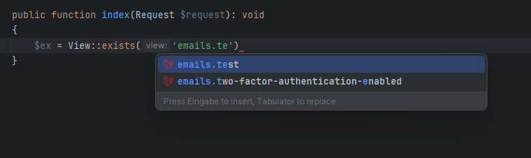
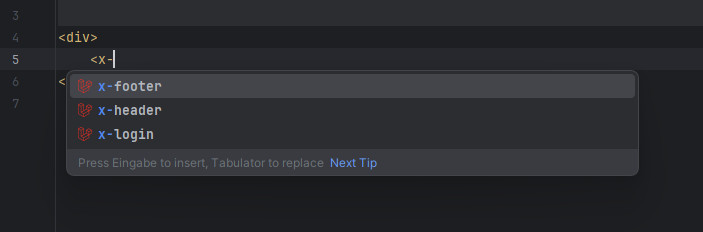

# Blade

The plugin offers autocompletion for views file names by scanning all Blade files in your project, 
making it easy to reference and navigate to blade view files.

It also provides autocompletion for the following methods:
* `Illuminate\Support\Facades\View::make()`
* `Illuminate\Support\Facades\View::first()`
* `Illuminate\Support\Facades\View::exists()`
* `Illuminate\Support\Facades\View::composer()`
* `Illuminate\Support\Facades\View::creator()`
* `Illuminate\Support\Facades\Route::view()`

## Blade components

The plugin provides autocompletion for blade component tags,
making it easy to reference and navigate to blade components.

