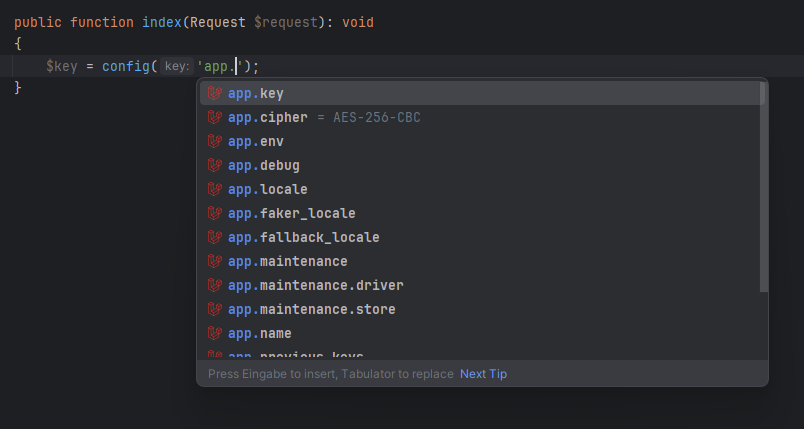

# Config

The plugin provides autocompletion for configuration files and their keys by scanning the project's config directory.
It fetches all available config files based on your project type and settings, ensuring quick, accurate access and easy navigation to config keys

It also provides autocompletion for the following methods:
* `Illuminate\Support\Facades\Config::get()`
* `Illuminate\Support\Facades\Config::fhas()`
* `Illuminate\Support\Facades\Config::array()`
* `Illuminate\Support\Facades\Config::boolean()`
* `Illuminate\Support\Facades\Config::float()`
* `Illuminate\Support\Facades\Config::integer()`
* `Illuminate\Support\Facades\Config::string()`
* `Illuminate\Support\Facades\Config::getMany()`
* `Illuminate\Support\Facades\Config::set()`
* `Illuminate\Support\Facades\Config::prepend()`