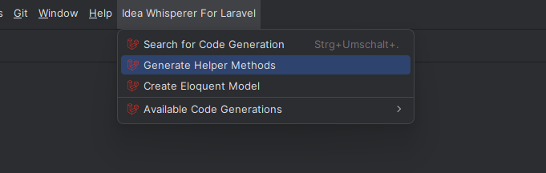

# Helper Code Generation

Eloquent uses a lot of magic, which PhpStorm can't understand by default.
The Generate Eloquent Helper Code command (available under the Idea Whisperer For Laravel menu) creates helper code by
fetching table information from migration files and linking it to your models.

Once generated, PhpStorm will provide autocompletion for Eloquent's magic methods, making development faster and smoother.

::: info
Autocompletion for Eloquent fields in methods is coming soon and currently under development.
:::

## Database tables

The plugin provides autocompletion for table fields by analyzing the migration files in your project.

