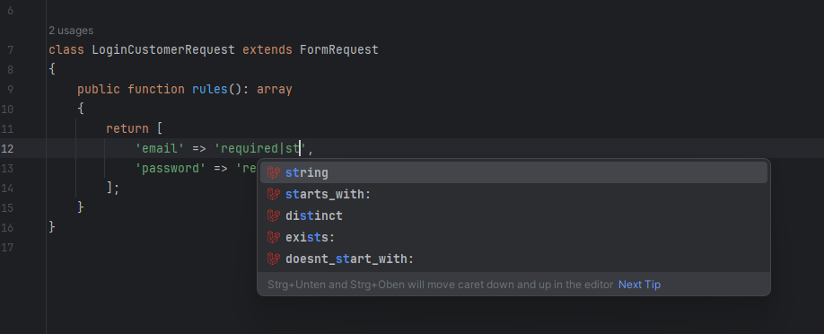
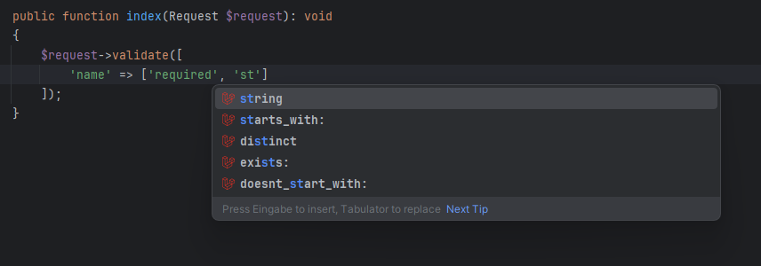
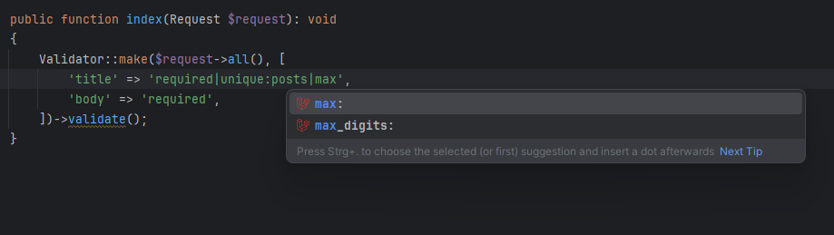
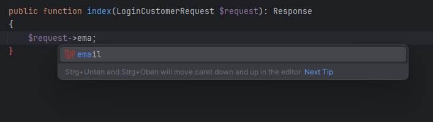

# Request validation

## Validation rules

Autocompletion for Laravel validation rules is available,
helping you quickly add validation rules in your requests.
Additionally, it enables quick navigation to validation rule declarations.
Simply hold **Ctrl + right-click** to jump directly to the rule's definition.

## Field Request completion

It also supports autocompletion for field requests, allowing you to navigate directly to their declarations.

