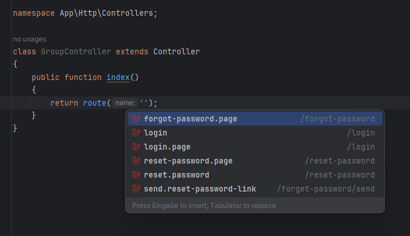
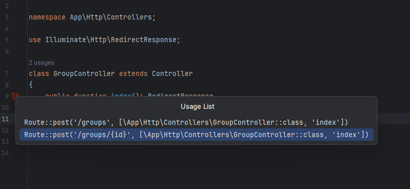

# Routing

The plugin automatically scans all route files in your Laravel project, retrieves route names
and provides autocompletion for them. This ensures you can easily reference route names in your code.

The plugin offers route name autocompletion and resolving for the following methods:
- `route()`
- `to_route()`

::: info
Support for additional methods to provide route name autocompletion is coming soon.
- `signedRoute('dashboard');`
- `Redirect::route('dashboard');`
- `Redirect::signedRoute('dashboard');`
- `URL::route('dashboard');`
- `URL::signedRoute('dashboard');`
- `Route::middleware('auth');`
:::

## Line marker for routes

Line markers are available for routes used in supported methods, making it easy to navigate directly
to their declarations with a single click.

