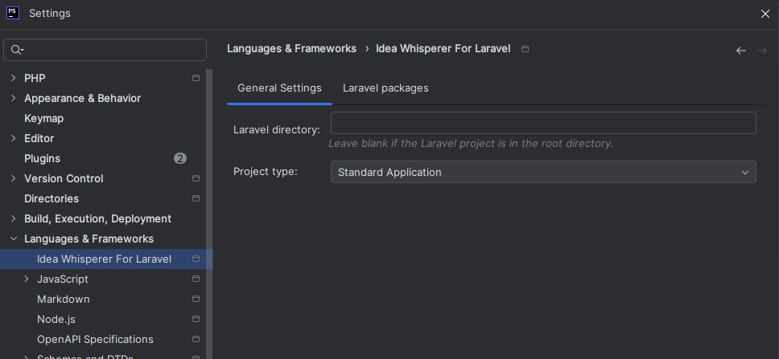

# Settings

By default, the plugin checks for the presence of `laravel/framework` folder.
Plugin features will only work if one of these packages is found.

## General settings

| Setting                 | Description                                                                                  | Default Value         |
|-------------------------|----------------------------------------------------------------------------------------------|-----------------------|
| **Laravel Directory**   | The Laravel Directory option is useful when your Laravel installation is not in the project root      | `""` (empty)          |
| **Project Type**        | Choose between "Standard Application" or "Module Based Application".                       | `Standard Application`|
| **Modules Directory**   | Path to the root directory for modules (visible for Module Based Applications).            | `Modules`             |
| **Module Source**       | Specify the source directory for modules. Leave blank if the source is `app`.              | `app`                 |

## Laravel packages settings

| Setting                           | Description                                                       | Default Value                |
|-----------------------------------|-------------------------------------------------------------------|------------------------------|
| **Inertia Page Component Paths**  | Manage paths for Inertia components. | `resources/js/Pages`         |

## Project types

### Standard Application

Choose this option for a traditional/standard Laravel project structure.
This is the default project type.
This option assumes a single-directory structure without modular separation.

Components like routes, config files, and views are organized within their respective default Laravel directories.

### Module Based Application

Select this option if your Laravel project is organized into a modular structure.
This is ideal for large-scale applications where functionality is split into independent modules.

- **Root Directory:** Specifies the main folder where all modules are stored. By default, this is set to `Modules`.
- **Module Source:** Defines the directory inside each module where source code (like Controllers, Models) is located.
Leave blank to use the default app directory. By default, this is set to `app`.